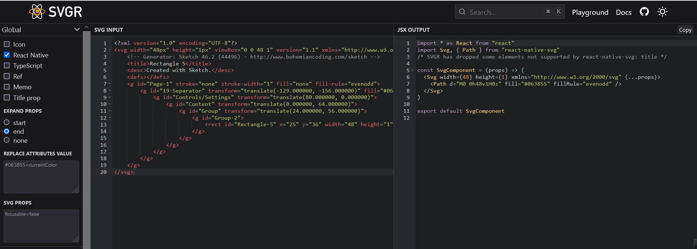

# react-native-notes

# SVG on react native

## Installation

### With expo-cli

> ✅ The [Expo client app](https://expo.io/tools) comes with the native code installed!
> Install the JavaScript with:

```bash
expo install react-native-svg
```

📚 See the [**Expo docs**](https://docs.expo.io/versions/latest/sdk/svg/) for more info or jump ahead to [Usage](https://github.com/react-native-svg/react-native-svg/blob/main/USAGE.md).

### With react-native-cli

1. Install library

   from npm

   ```bash
   npm install react-native-svg
   ```

   from yarn

   ```bash
   yarn add react-native-svg
   ```

2. Link native code

   ```bash
   cd ios && pod install
   ```

### Usage

- Copy the SVG code and paste into [SVGR Playground's](https://react-svgr.com/playground/?native=true) input
- Chose in which formate you want to get your code and use it!

<a href="https://react-svgr.com/playground/?native=true">

</a>
